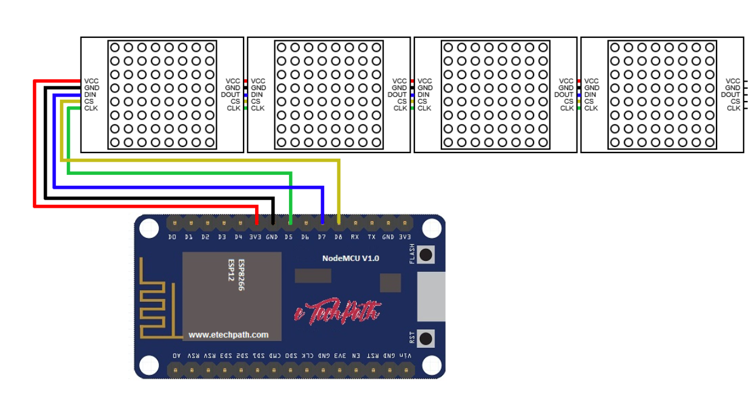

# Wireless-LED-Matrix-Message-Bar

Code for wireless message bar consisting of LED matrix and nodeMCU module.

# NodeMCU

NodeMCU is an open source IoT platform. It includes firmware which runs on the ESP8266 Wi-Fi and hardware which is based on the ESP-12 module. The term "NodeMCU" by default refers to
the firmware rather than the development kits. The firmware uses the Lua scripting language. It is based on the eLua project, and built on the Espressif Non-OS SDK for ESP8266. It uses
many open source projects.

# How to Use

The message on LED matrix display can be uploaded with WIFI. Once you are connected with WIFI with your credentials, open your brower and enter your server's IP address and hit enter 
(or go on mobile phone). A webpage will open with a text field and  a 'Submit' button. Type your message and hit the 'Submit' button. Your message begin scrolling on the LED matrix 
display.
